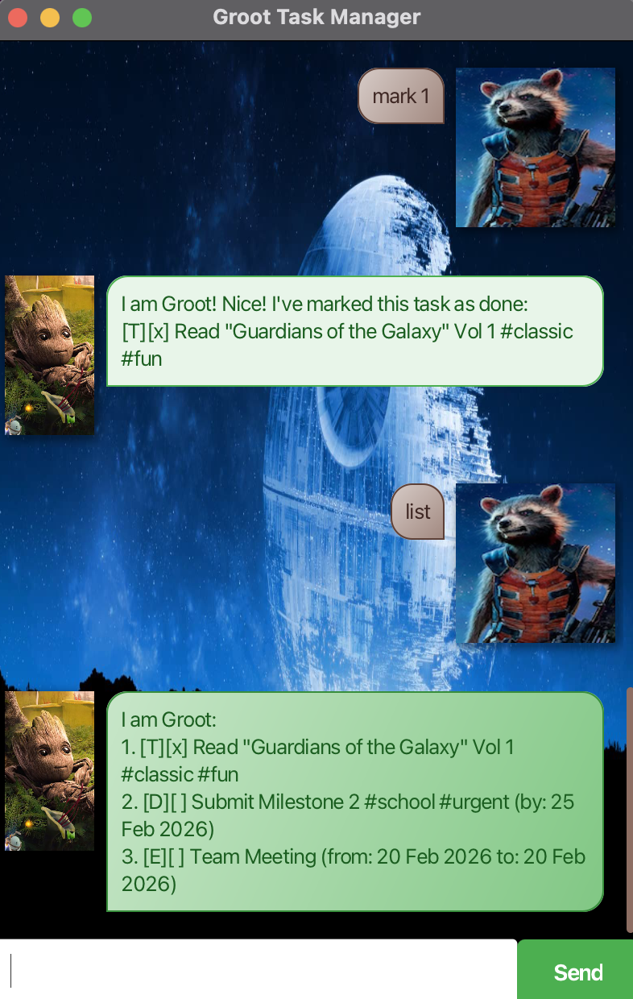

# Groot User Guide

**Groot** is a desktop task management chatbot that helps you track todos, deadlines, and events. It features a simple command-line interface, a Guardians of the Galaxy theme, and persists your data locally.

## Quick Start

1. Run the application (ensure you have Java 17+ installed).
2. Type commands into the text box and press **Enter**.
3. Type `bye` to exit.

---

## Features

> [!IMPORTANT]
> **Understanding Contextual Indexing:** > Groot is smart—commands that use an `INDEX` (like `mark` or `delete`) target the **most recently shown list**. 
> * If you just searched for `#work`, `mark 1` marks the first result of that search. 
> * To return to the full list and reset the index context, simply run the `list` command.

### Viewing tasks: `list`
Displays all tasks currently in your list and resets the indexing context to include all tasks.
- **Format:** `list`

### Adding a todo: `todo`
Adds a simple todo task. Groot will refuse to add the task if an identical description already exists.
- **Format:** `todo DESCRIPTION`
- **Example:** `todo Buy groceries`

### Adding a deadline: `deadline`
Adds a task with a due date. Groot uses **strict date validation**; impossible dates (e.g., Feb 31st) will be rejected.
- **Format:** `deadline DESCRIPTION /by yyyy-MM-dd`
- **Example:** `deadline Submit report /by 2026-02-20`

### Adding an event: `event`
Adds a task with a start and end date. The end date cannot be before the start date.
- **Format:** `event DESCRIPTION /from yyyy-MM-dd /to yyyy-MM-dd`
- **Example:** `event Team meeting /from 2026-02-15 /to 2026-02-15`

### Marking/Deleting tasks: `mark`, `unmark`, `delete`
Modifies or removes a task based on the **currently visible list**.
- **Format:** `mark INDEX`, `unmark INDEX`, or `delete INDEX`
- **Example:** `mark 1`

### Finding tasks: `find`
Searches for tasks by keyword or by tag. Subsequent index-based commands will act on these results.
- **Format:** `find KEYWORD` or `find #TAG`
- **Example:** `find #work`

### Tagging a task: `tag`
Adds one or more tags to a task. Groot automatically adds the `#` prefix, normalizes text to lowercase, and ignores duplicate tags.
- **Format:** `tag INDEX TAG1 [TAG2] ...`
- **Example:** `tag 1 fun urgent`

### Removing a tag: `untag`
Removes a specific tag from a task.
- **Format:** `untag INDEX TAG`
- **Example:** `untag 1 fun`

### Exiting: `bye`
Exits the application. The input UI will disable before the application closes automatically after a short pause.
- **Format:** `bye`

---

## Command Summary

| Command | Format | Description |
| :--- | :--- | :--- |
| **list** | `list` | List all tasks and reset view context |
| **todo** | `todo DESCRIPTION` | Add a simple todo task |
| **deadline** | `deadline DESC /by yyyy-MM-dd` | Add a task with a strict due date |
| **event** | `event DESC /from yyyy-MM-dd /to yyyy-MM-dd` | Add a task with a date range |
| **mark** | `mark INDEX` | Mark task from **current view** as done |
| **unmark** | `unmark INDEX` | Mark task from **current view** as not done |
| **delete** | `delete INDEX` | Remove task from the **current view** |
| **find** | `find KEYWORD` or `find #TAG` | Filter tasks by description or hashtag |
| **tag** | `tag INDEX TAG1 [TAG2...]` | Add one or multiple tags |
| **untag** | `untag INDEX TAG` | Remove a tag from a task |
| **bye** | `bye` | Save data and exit the application |

---

## Notes

- **Contextual Indexing:** Always use the 1-based number shown in the window. If the task you want to modify isn't visible because of a previous `find` command, run `list` to see everything again.
- **Duplicate Detection:** Groot prevents adding a task that has the same description and dates as an existing entry.
- **Strict Date Parsing:** Dates must be valid calendar dates. Impossible dates like `2026-02-31` will trigger an error.
- **Tag Normalization:** Tags are stored in lowercase. You do not need to type the `#` symbol when using the `tag` command; Groot handles it for you.